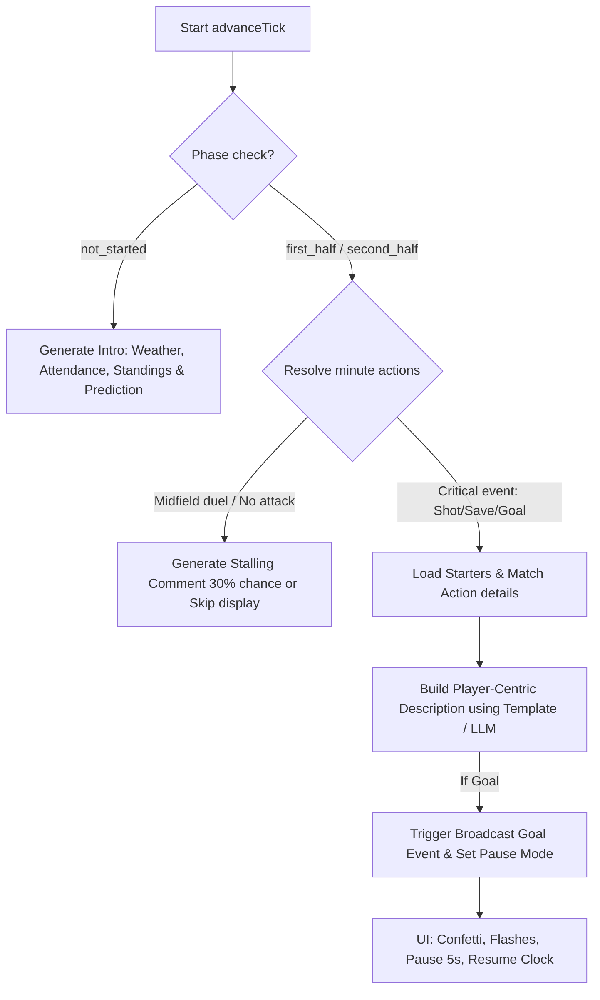

# SIP-0031 — Dynamic Commentary Enhancements & Visual Goal Celebrations

| Field   | Value                 |
|---------|-----------------------|
| Status  | Accepted (Implemented)     |
| Author  | Gold Manager Dev Team |
| Created | 2026-05-17            |

## Summary

This proposal outlines the implementation plan to make the live match and replay commentary (telecronaca) significantly more engaging, premium, and visually impressive. 

We address the following objectives:
1. **Dynamic Match Intro**: Pre-match reports featuring randomized weather, pitch conditions, spectator attendance based on stadium capacity, league standing commentary, and algorithmic predictions.
2. **Player-Centric Commentary**: Enriched text including player names and clear indicators of ownership (Own Team vs. Opponent).
3. **Midfield Stalling Logic**: Filtering uninteresting minutes and replacing them with generic commentator remarks ("il gioco staziona a centrocampo", etc.) to pace the simulation like a real broadcast.
4. **LLM & Rich Semantic Generator**: An optional LLM integration (using the local OpenClaw proxy) combined with a highly varied Italian templated phrase engine.
5. **Visual Goal Celebrations & Pause**: On goal events, the interface will display flashing photographer flashes, a shower of confetti, crowd chant animations, and temporarily pause the clock ticks for celebration before resuming.

---

## Technical Specifications



### Part 1 — Dynamic Match Intro

Before kickoff (minute 0 / `not_started` phase), we will generate a pre-match atmosphere report.

#### 1. Weather and Pitch Generator
We will randomize the match day conditions based on seasonal settings or simple probability pools:
- **Weather**: *Sereno, Piovoso, Nevoso, Nebbioso, Vento Forte*.
- **Pitch Condition**: *Eccellente, Fangoso, Secco, Scivoloso*.
*Impact*: In the future, these can apply small attribute multipliers (e.g., muddy pitches decrease speed/freshness faster).

#### 2. Spectator Count
Calculated dynamically based on the home team's stadium capacity:
$$\text{Attendance} = \text{Capacity} \times \text{Random}(0.75, 1.0) \times \text{FormModifier}$$

#### 3. Standings & Predictions
We query the `Standing` table for both teams to inject dramatic context:
- **Derby / Match of the Day**: If the teams are from the same city or separated by $<3$ points in the top 5.
- **David vs Goliath**: If one team is in the top 3 and the opponent is in the relegation zone.
- **Algorithmic Hypothesis**: Compare average team skills (`general_skill`) and apply home-court advantage to generate a prediction (e.g., *"I bookmakers vedono favoriti i padroni di casa, ma gli ospiti cercano il colpaccio..."*).

---

### Part 2 — Player-Centric & Rich Commentary Engine

Rather than generic templates, match events must describe who did what, utilizing actual players on the pitch.

#### 1. Database & Model Updates
We will ensure that all events generated by the match engine store:
- `player_id`: The ID of the key actor (the shooter, the defender who made the tackle, the goalkeeper).
- `team_side`: `home` or `away` (to easily verify if it is the manager's team or the opponent).
- `detail`: A JSON object holding extra metadata (e.g. `{"goalkeeper_id": 12, "assister_id": 34, "distance": 22}`).

#### 2. Indicator of "Tua Squadra" vs "Avversario"
In `live.php` and `replay.php`, the frontend will compare the event's `team_side` with the user's team. If the match belongs to the logged-in manager's team:
- If `event.team_side == userTeamSide`: Display a subtle golden badge `[Tua Squadra]` or highlight the player's name in **Gold** (`#e2b855`).
- If `event.team_side != userTeamSide`: Display an `[Avversario]` tag or print the name in a neutral red/gray tone.

#### 3. Rich Italian Template Engine (Fallback)
We will introduce a semantic parser inside the engine (`v2/components/MatchEngine.php` and Go's `engine/match.go`) containing hundreds of phrase templates in Italian, cataloged by action:
- **Goal Templates**: 
  - *"{player} fa esplodere lo stadio con un destro sotto la traversa!"*
  - *"{player} ruba il tempo al portiere e infila la palla nell'angolino basso!"*
- **Save Templates**:
  - *"{goalkeeper} vola all'incrocio e toglie letteralmente la palla dalla porta!"*
  - *"{goalkeeper} si distende e blocca con sicurezza in due tempi."*

#### 4. Local LLM Integration (Docker-enabled Ollama/LocalAI)
For a premium experience, the engine will query a local, fully offline LLM service enabled directly in the `docker-compose.yml` stack:

##### A. Docker Compose Service Setup
We will add a self-contained local LLM container (using Ollama) with optional GPU delegation:

```yaml
  ollama:
    image: ollama/ollama:latest
    container_name: gold-manager-ollama
    volumes:
      - ollama-data:/root/.ollama
    expose:
      - "11434"
    restart: unless-stopped
    # Optional GPU acceleration for hosts with Nvidia runtime:
    # deploy:
    #   resources:
    #     reservations:
    #       devices:
    #         - driver: nvidia
    #           count: all
    #           capabilities: [gpu]
```

##### B. Model Selection
We will use a highly compact, ultra-fast model that runs exceptionally well on standard CPU servers (such as `qwen2:1.5b-instruct`, `gemma2:2b-instruct`, or `phi3:mini`). 
The service will pull the model on first initialization via a startup script:
`docker compose exec ollama ollama pull qwen2:1.5b`

##### C. API Communication
Both the Go and PHP match engines can request descriptions asynchronously or dynamically via the local HTTP JSON API (`http://ollama:11434/v1/chat/completions` - Ollama provides direct OpenAI compatibility):

```json
{
  "model": "qwen2:1.5b",
  "messages": [
    {
      "role": "system",
      "content": "Sei un telecronista calcistico italiano. Genera una singola frase entusiasmante e colorita dell'azione descritta."
    },
    {
      "role": "user",
      "content": "Minuto 23, tiro di {player_name} (propria squadra) deviato in angolo dal portiere avversario {goalkeeper_name}, pioggia battente."
    }
  ],
  "temperature": 0.7
}
```

---

### Part 3 — Midfield Stalling & Pacing Logic

Real matches aren't filled with critical actions every single minute. Showing all 90 minutes can feel repetitive.

1. **Selective Polling/Display**:
   - The UI will only show minutes where "something happens" (kickoff, cards, shots, saves, tactics, goals, half-time).
   - If there is a sequence of quiet minutes (e.g. 10' to 24' with no shots), we group them or generate a pacing comment.
2. **Commenti Generici a Centrocampo**:
   - If the engine resolves a minute without shots/goals (Midfield duel only), there is a 30% chance to write a generic pacing remark:
     - *"Il gioco staziona a centrocampo, ritmi lenti in questa fase."*
     - *"Fase confusa del match: molti passaggi sbagliati e pressing asfissiante a centrocampo."*
     - *"Squadre corte, le difese bloccano ogni tentativo di ripartenza."*
   - Other empty minutes will be omitted from the events list entirely so the user doesn't get bored.

---

### Part 4 — Visual Goal Celebrations & UI Animations

When a goal is detected in `live.php` or `replay.php`:

#### 1. Confetti & Visual Flash Effects
- We will integrate the lightweight `canvas-confetti` library via CDN or dynamic inject.
- On goal events, the JS controller will:
  - Call a custom function `triggerGoalCelebration(teamSide)`.
  - Flash the background of the screen with a rapid white opacity transition (`@keyframes flash` - photographer flash effect).
  - Launch a colorful confetti blast from the bottom-left and bottom-right of the viewport.
  - Animate the scoreboard with a glowing scale pulsation.

#### 2. Temporary Tick Pause
- In `live.php` polling, if a `goal` event is received, the script will **pause** the tick loop or delay updating the clock by **5 seconds**.
- An animated banner will appear on screen: **GOOOOOOL!** with crowd chants represented visually (e.g., floating text).
- After the 5-second pause, the ticker resumes automatically.
- In `replay.php`, the playback is paused for `5000 / speedMultiplier` milliseconds on goal, then continues.

---

## Technical Implementation Plan

### Step 1: Frontend Additions (`live.php` & `replay.php`)
- Include `canvas-confetti` CDN script:
  ```html
  <script src="https://cdn.jsdelivr.net/npm/canvas-confetti@1.6.0/dist/confetti.browser.min.js"></script>
  ```
- Implement `triggerGoalCelebration()` with flashes, confetti, and a scoreboard pulse:
  ```javascript
  function triggerGoalCelebration() {
      // CSS Photographer Flash
      const flash = document.createElement('div');
      flash.className = 'goal-flash-overlay';
      document.body.appendChild(flash);
      setTimeout(() => flash.remove(), 1000);

      // Confetti Blast
      confetti({ particleCount: 150, spread: 80, origin: { y: 0.8 } });
  }
  ```
- Implement the 5-second clock pause logic.

### Step 2: Database Schema & MatchEngine Enrichment
- Modify `saveEvent` to pull names from `Player::findOne($playerId)` and inject them into dynamic template strings.
- Add pre-match `kickoff` detail dictionary with weather, spectators, and algorithmic prediction.

---

## Acceptance Criteria

- [ ] Match introduction (minute 0 / `kickoff`) generates weather, spectator details, and team predictions.
- [ ] Ticker events contain player names, indicating ownership status (`[Tua Squadra]` or `[Avversario]`).
- [ ] Stalling minutes generate realistic generic commentary instead of empty rows, while uninteresting ticks are compacted.
- [ ] Scoreboard flashes, screen photographer effect, and dynamic confetti are triggered immediately upon goals.
- [ ] Poll/Replay timer pauses for 5 seconds on goal to display the celebration animation before resuming.

---

## Related SIPs

- [[SIP-0020]] — Match Engine Architecture
- [[SIP-0024]] — Character Traits modifiers
- [[SIP-0030]] — Friendly Matches and calendar management
